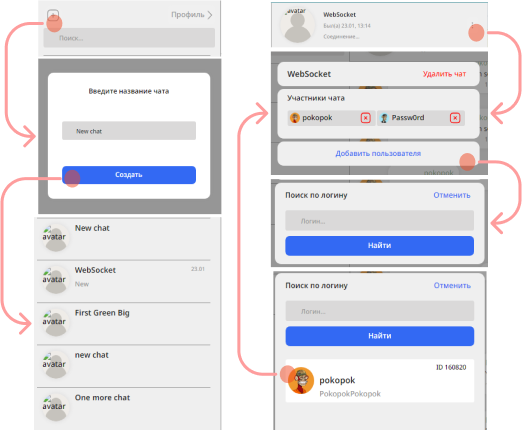

## Описание

- **Приложение**. Мессенджер для обмена сообщениями.
- **Возможности**. Создание личных чатов, групповых чатов, отправка текстовых сообщений и медиа файлов.
>**Готовность**. На данный момент реализованы: 
  >>   - авторизация/регистрация
  >>   - примитивный стэйт менеджер, 
  >>   - создание/удаление комнат (чатов), 
  >>   - добавление/удаление пользователей в(из) комнаты (чата), 
  >>   - поиск пользователей
  >>   - получение/отправка текстовых сообщений
  >>   - настройки профиля пользователя
  >>   - роутинг : 
  >>>   - ```/``` - страница логинизации 
  >>>   - ```/sign-up``` - страница регистрации 
  >>>   - ```/messenger``` - страница чатов 
  >>>   - ```/settings``` - страница профиля 
  >>>   - ```/settings/user``` - страница редактирования профиля 
  >>>   - ```/settings/password``` - страница установки нового пароля 
  
  
  >  
  
## Установка

- ```npm run dev``` — запуск версии для разработчика,
- ```npm run start``` — сборка и запуск стабильной версии локально,
- ```npm run build``` — сборка стабильной версии.

## Ссылка на макет в Figma
https://www.figma.com/file/GlBCOegk56WmcpbRkYOTIX/Chat_external_link-(Copy)?node-id=0%3A1&t=wxDwHouc2xSItVZ7-3

## Ссылка на опубликованную версию
https://deploy-preview-9--luxury-fudge-16f55d.netlify.app

## Стэк используемых технологий 
> - Typescript
> - Parcel
> - Handlebars JS
> - PostCSS
